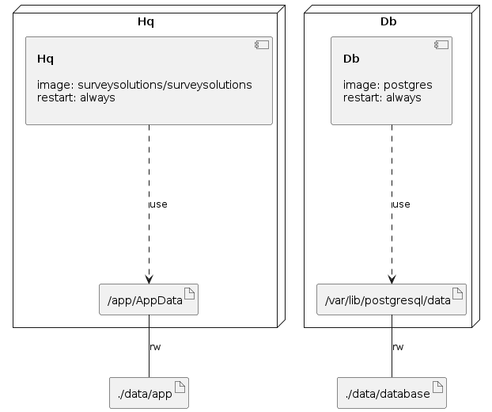

# Survey Solutions in Docker

This repository contains sample configuration for `docker-compose` to be able to run Survey Solutions Headquarters with docker.

Docker images are hosted by Docker Hub: <https://hub.docker.com/r/surveysolutions/surveysolutions>

## Note

While those compose files can be used to run in production environment. We strongly recommend to run Postgres database on separate server or using managed solutions from Cloud providers.

### Prerequisite

#### Linux server with docker support

This can be literally any linux server hosted on any cloud or on-prem provider with public IP or DNS name.

#### Domain name

This can be any domain You own. If you don't have one - there is plenty free domains available.

`A` record for this domain should point to public IP address of Your server

## How to use

1. Clone or [fork this repository](https://github.com/surveysolutions/docker-compose/fork)
2. Adjust `.env` file with Your own domain name. Default value will only work with non-ssl version of configuration.

### Without SSL

Use `run.sh` file to spin up HQ without SSL. In this mode default value for  `HQ_HOST=hq.lvh.me` in `.env` will for localhost connections

### With SSL

Use `run.ssl.sh` file to spin up HQ with Automatic SSL support.

Automatic SSL is handled by `Traefik` proxy server via Let's Encrypt

## With database backups

There is a project that can help You to automatically periodically backup HQ database: <https://github.com/prodrigestivill/docker-postgres-backup-local>

Configuration in docker-compose can be found here at [docker-compose.backup.yml](/docker-compose.backup.yml)

To run with backups You can use following commands:

```bash
 # Without SSL
 docker-compose -f docker-compose.yml -f docker-compose.backup.yml up -d

 # With SSL
 docker-compose -f docker-compose.yml -f docker-compose.ssl.yml -f docker-compose.backup.yml up -d
```

## Postgres

While running Postgres instance in docker is viable solution, we strongly recommend to run Postgres in separate server or use "managed" solutions provided by cloud providers(i.e. Amazon RDS, Azure Database for PostgreSQL, Google Cloud SQL, etc...)


### Infrastructure model

